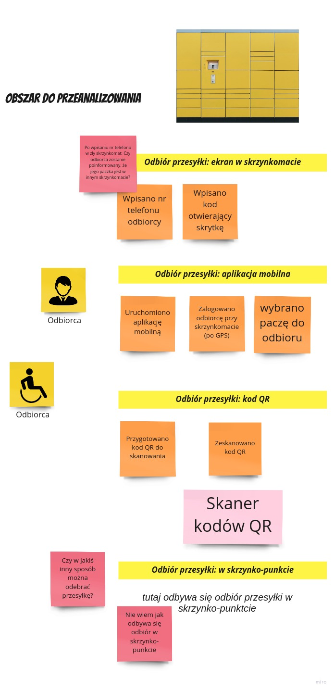
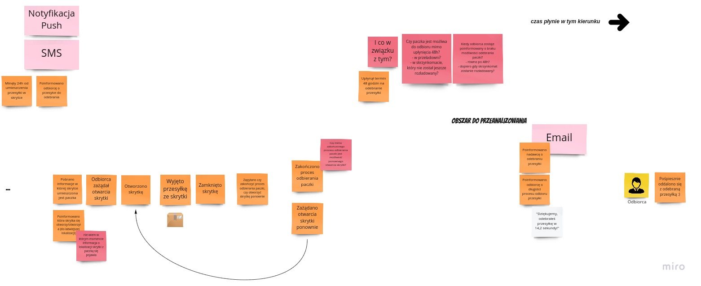

# Domain Explorers

# Spis treści

1. [O repozytorium](#o-repozytorium)
2. [Analiza domeny](#analiza-domeny)
   1. [Big Picture EventStorming](#big-picture-eventstorming)
      1. [Załadunek skrzynkomatu](#załadunek-skrzynkomatu)
      2. [Tymczasowy załadunek skrzynkomatu lub skrzynko-punktu](#tymczasowy-załadunek-skrzynkomatu-lub-skrzynko-punktu)
      3. [Rozładunek skrzynkomatu lub skrzynko-punktu](#rozładunek-skrzynkomatu-lub-skrzynko-punktu)
      4. [Przedłużenie terminu odbioru paczki](#przedłużenie-terminu-odbioru-paczki)
      5. [Odbiór przesyłki](#odbiór-przesyłki)

## O repozytorium

Ten projekt stanowi zapis analizy, modelowania oraz implementacji w ramach [Domain Explorers](https://explorers.bettersoftwaredesign.pl). Znajdziesz tutaj zarówno artefakty wynikowe poszczególnych sesji EventStormingu, modelowania, jak i (docelowo) powstałą na tej bazie implementację.

## Analiza domeny

### Big Picture EventStorming

#### Załadunek skrzynkomatu

#### Tymczasowy załadunek skrzynkomatu lub skrzynko-punktu

#### Rozładunek skrzynkomatu lub skrzynko-punktu

#### Przedłużenie terminu odbioru paczki

#### Odbiór przesyłki
cz.1 \

\
cz.2 \

Aby zobaczyć pełną wersję boarda na miro.com, kliknij [tutaj](https://miro.com/app/board/o9J_lWWayxM=/).
